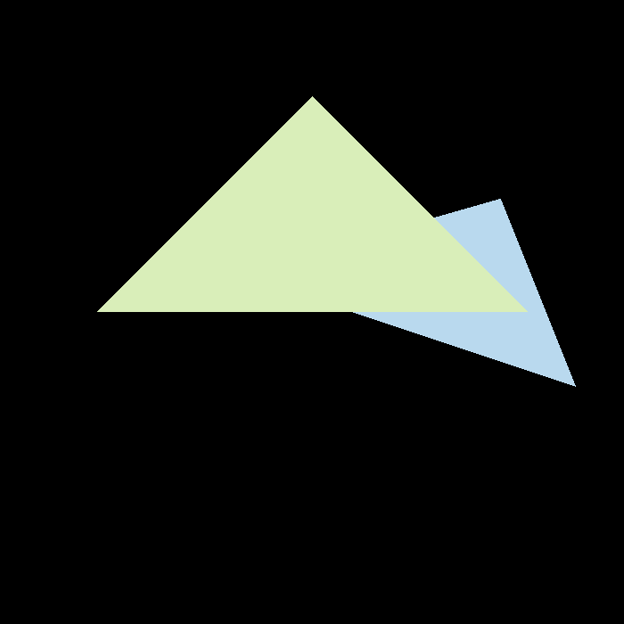
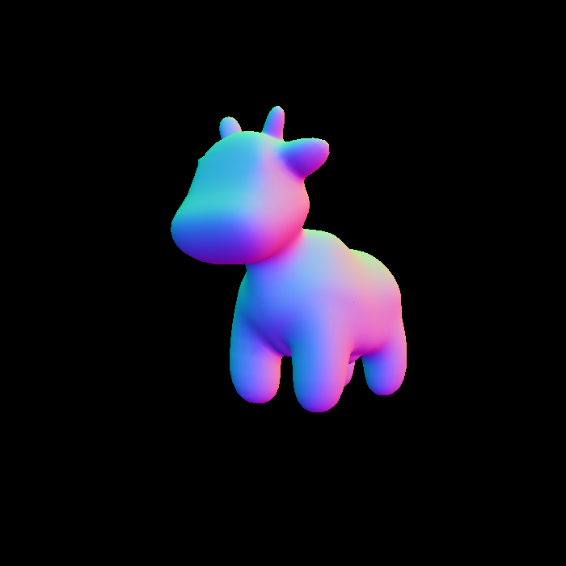
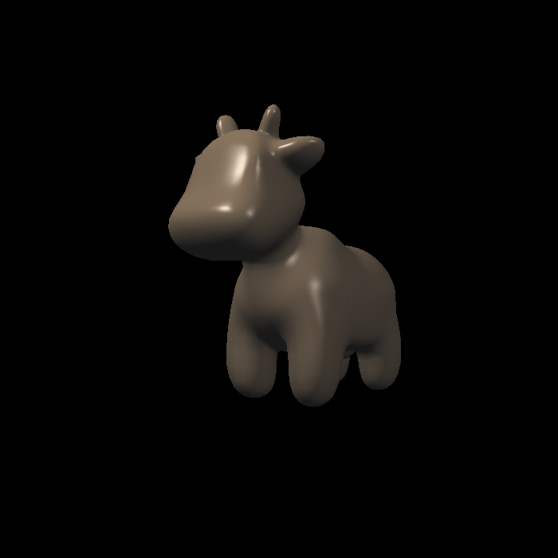
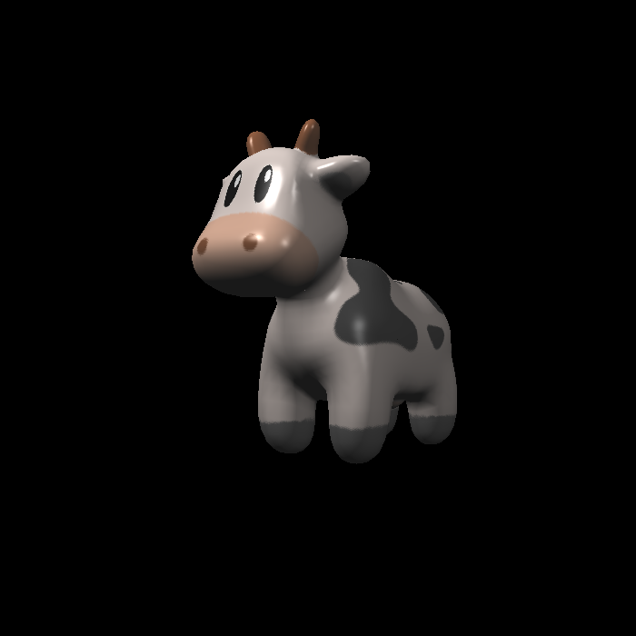
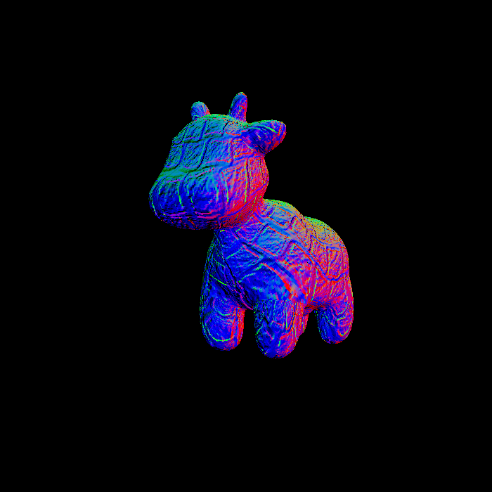
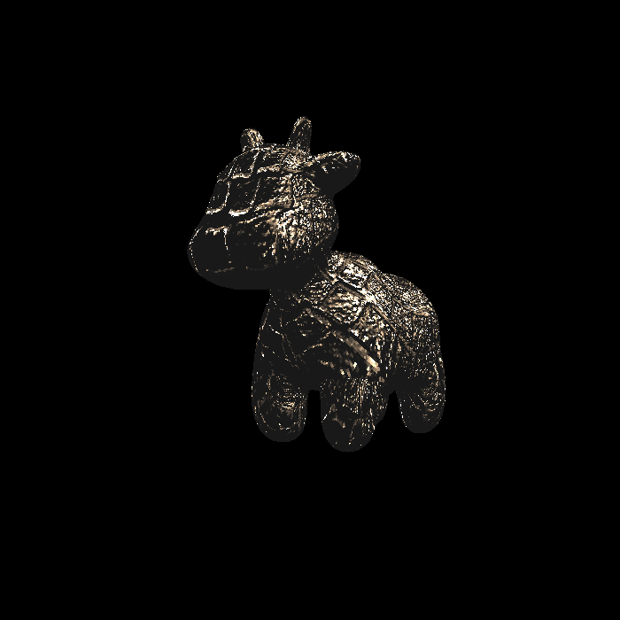
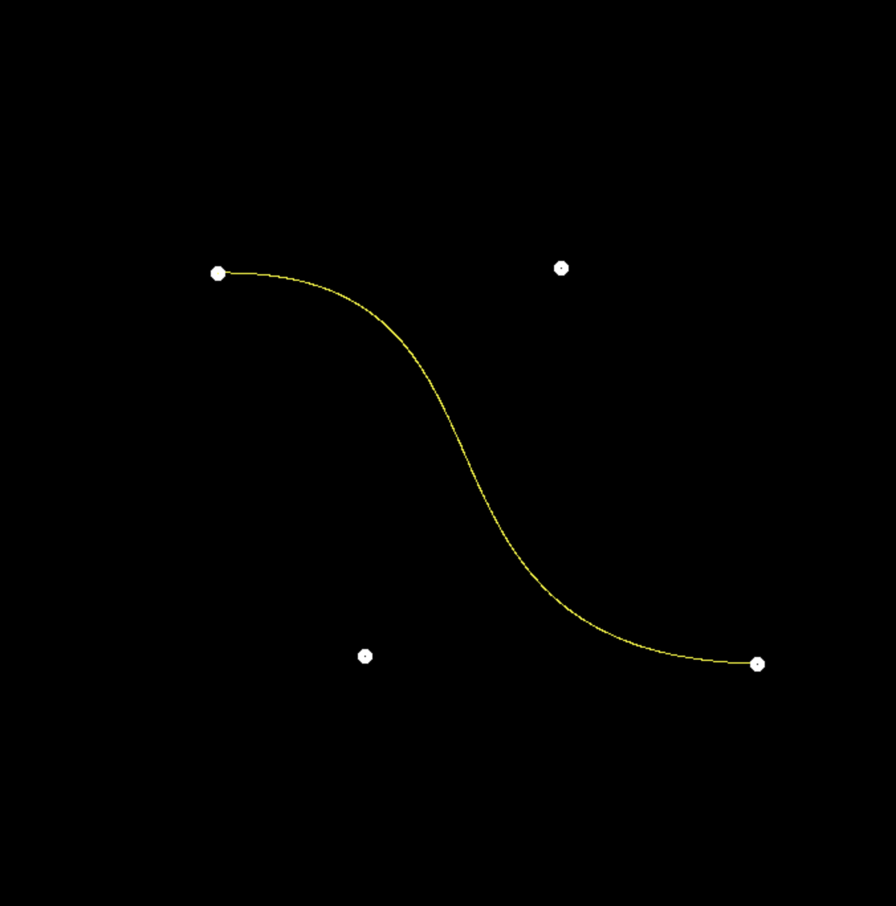
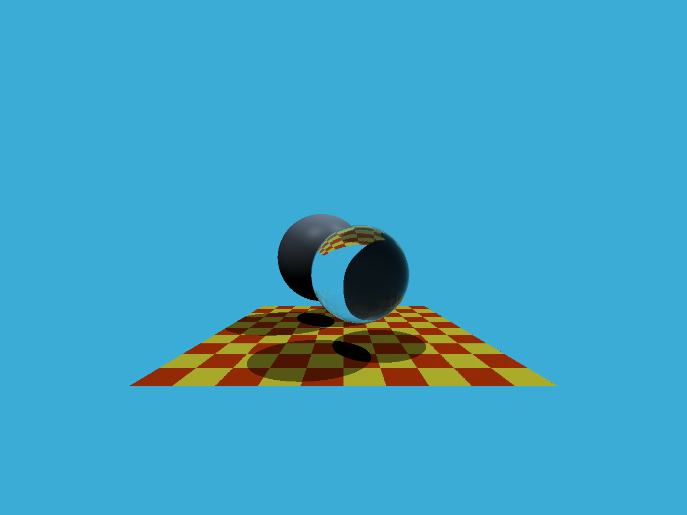
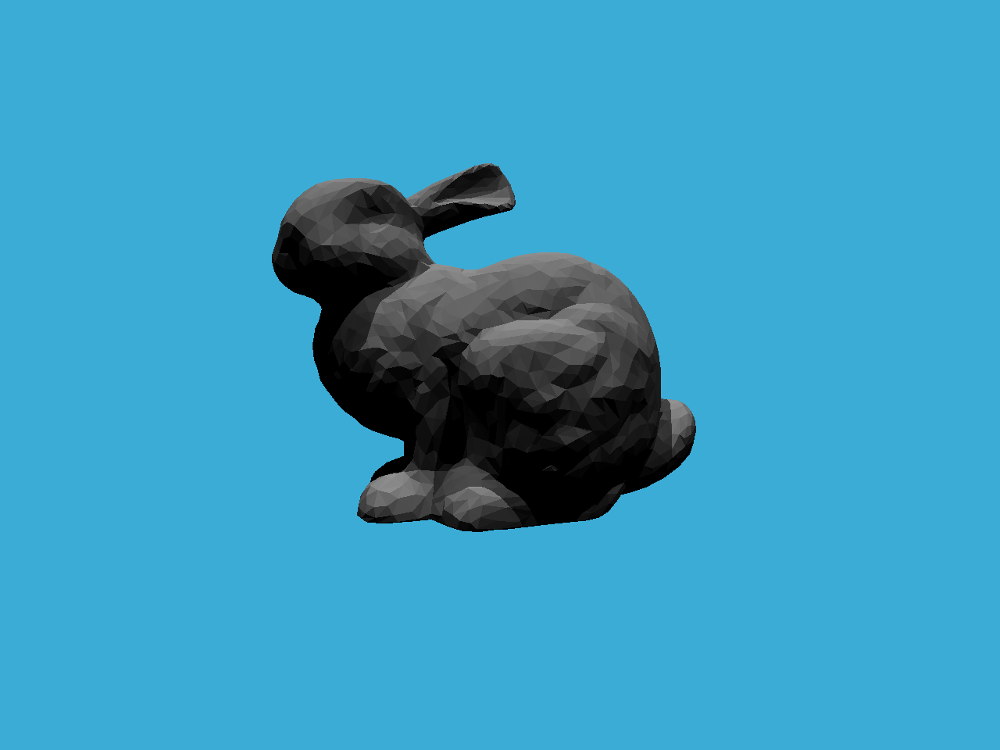

# GAMES101

https://sites.cs.ucsb.edu/~lingqi/teaching/games101.html

## HW1

https://github.com/WUY97/GAMES101/assets/44213937/035ededb-fa7d-439c-abc2-9183f6bf08da

## HW2

## HW3

## HW4

## HW5

## HW6

